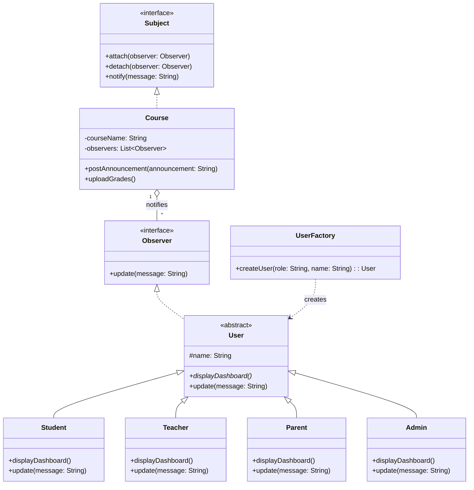

# Smart University Learning Management System (LMS) - Design Patterns

## 1. Key Software Design Challenges
1. **Role-based Dashboards and Feature Access:** The system has multiple distinct users (Students, Teachers, Administrators, Parents) who each need customized dashboards and specific capabilities. Creating and managing these different user objects in a scalable way is a challenge.
2. **Real-time Notifications:** When an event occurs (e.g., a teacher posts an announcement or uploads grades), multiple distinct entities (students, parents, course coordinators) need to be notified automatically and immediately without tightly coupling the teacher's action to the notification system.
3. **Future Extensibility:** The system must support the seamless integration of future services (AI Tutor, Video Conferencing, etc.) without requiring massive modifications to the core existing structure.

## 2. Selected Design Patterns
Based on the challenges above, the following two design patterns have been selected:
1. **Factory Method Pattern (Creational Pattern)**
2. **Observer Pattern (Behavioral Pattern)**

## 3. Justification for the Selected Patterns
* **Factory Method Pattern:** This pattern is appropriate for user creation. Instead of instantiating `Student`, `Teacher`, `Parent`, or `Admin` classes directly all over the codebase, a `UserFactory` handles the instantiation. This resolves the challenge of providing customized dashboards based on user roles and makes adding new roles in the future incredibly easy.
* **Observer Pattern:** This pattern is perfect for the notification system. The `Course` (Subject) maintains a list of interested users (Observers). When an event occurs in the course (like posting grades), it simply calls a `notify()` method, which automatically updates all subscribed users. This decouples the event source from the notification recipients.

## 4. UML Class Diagram

## 5. Implementation
The design patterns have been implemented in Python. Please refer to the `lms_design_patterns.py` file included in this directory.
